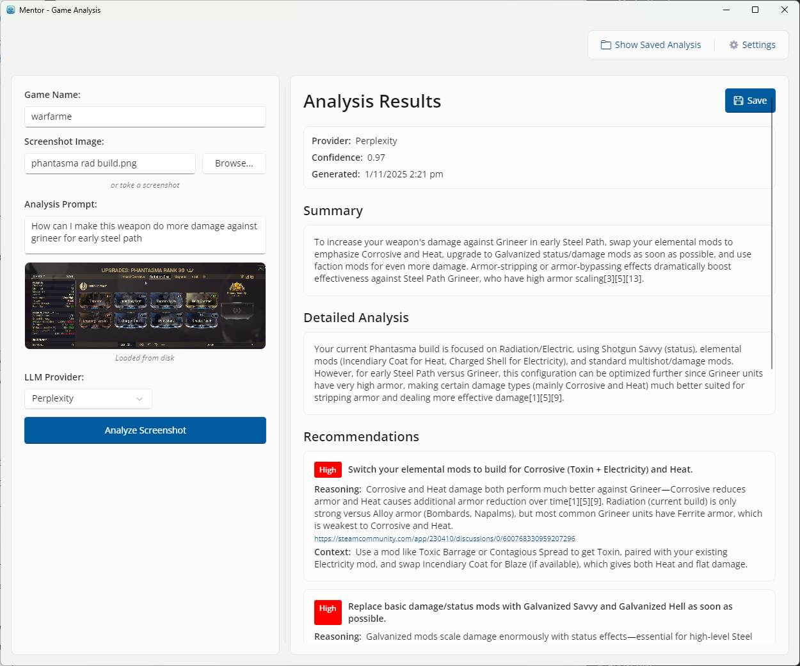
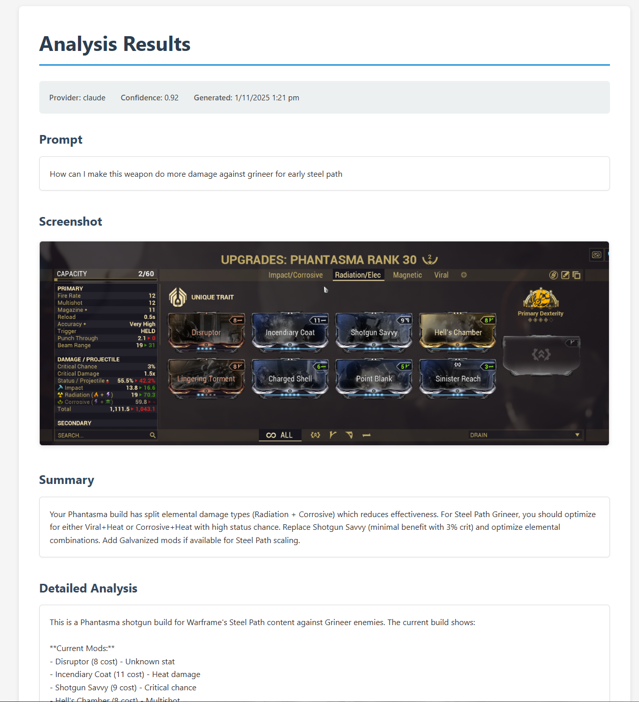
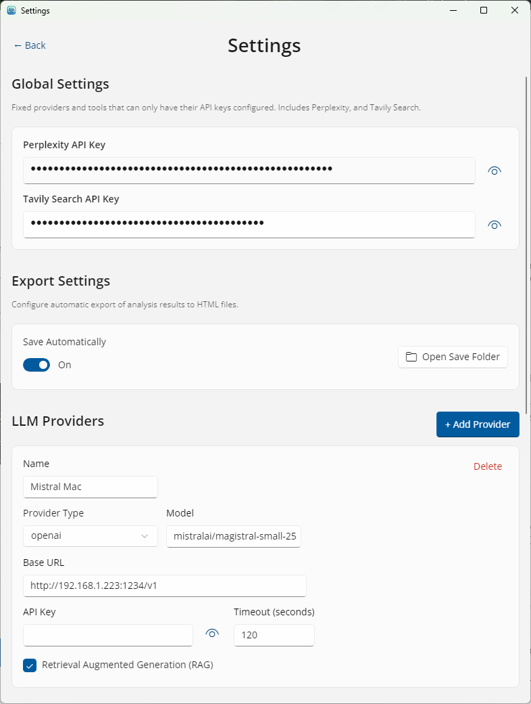

# Mentor - AI-Powered Game Analysis

> Get instant, actionable recommendations for your gameplay through intelligent screenshot analysis

## What It Does

Mentor analyzes your game screenshots using advanced AI to provide strategic recommendations, build suggestions, and gameplay insights. Simply capture your screen, ask your question, and Mentor tells you what to do next.

Whether you're optimizing your character build, deciding on your next objective, or seeking strategic advice, Mentor provides clear, prioritized recommendations backed by AI analysis and real-time web research.

## Why

I started playing Warframe, and it's a bit "what the heck do I do now?" and "how can I make this weapon not suck?". I found punting images and prompts into Perplexity to be quite good, so thought hey - why not put together an app?

## Features

- 🎯 **Smart Analysis** - AI-powered recommendations tailored to your specific game state
- 🔍 **Multi-Provider Support** - OpenAI GPT-*, Perplexity, Claude, and local (if you must) compatible providers
- 🌐 **Web Search Integration** - Real-time research using Tavily API (I tried Brave, it's in there, just not as good)
- 📊 **Priority-Based Results** - Recommendations ranked by importance (High, Medium, Low)
- 💾 **Export Analysis** - Save your analysis with screenshots as HTML for future reference
- 📋 **Clipboard Monitoring** - Automatically detects when you paste screenshots
- ⚡ **Cross-Platform** - Runs on Windows, macOS, and Linux (last two not really tested)
- 🎨 **Modern UI** - Clean, responsive interface built with Uno Platform

## Screenshots

### Main Analysis Interface


*Screenshot placeholder - Upload or paste your game screenshot, enter your question, and select an AI provider*

### Analysis Results


*Screenshot placeholder - View detailed, prioritized recommendations with reasoning and context*

### Settings & Configuration


*Screenshot placeholder - Configure LLM providers and search tools with your API keys*

## Quick Start

### Download & Run

Download the latest release for your platform from the [Releases](https://github.com/scornflake/mentor-game-analysis/releases) page, or build from source:

```bash
# Clone the repository
git clone https://github.com/scornflake/mentor-game-analysis.git
cd mentor-game-analysis

# Run the desktop application
dotnet run --project src/Mentor.Uno/Mentor.Uno
```

**Requirements:**
- .NET 8 SDK (for core libraries)
- .NET 9 SDK (for desktop UI)

For detailed build instructions, see [Building.md](Building.md).

## How to Use

1. **Launch Mentor** - Start the desktop application
2. **Configure API Keys** - Click Settings and add your AI provider API keys
3. **Load a Screenshot**:
   - Click "Browse" to select an image file
   - Or paste directly from clipboard (auto-detected)
   - Or drag & drop an image file
4. **Enter Your Question** - E.g., "What should I focus on?" or "How can I optimize this build?"
5. **Select AI Provider** - Choose from configured providers (OpenAI, Perplexity, Claude, etc.)
6. **Click "Analyze Screenshot"** - Wait for AI analysis (typically 10-30 seconds)
7. **Review Recommendations** - See prioritized suggestions with detailed reasoning
8. **Export (Optional)** - Save the analysis with screenshot as HTML

### Example Questions

- "What should I do next in this game?"
- "How can I optimize this character build?"
- "What's wrong with my current setup?"
- "What items should I prioritize?"
- "How do these stats compare to meta builds?"

## Configuration

### Getting API Keys

You'll need API keys from at least one LLM provider:

- **OpenAI**: [platform.openai.com/api-keys](https://platform.openai.com/api-keys)
- **Perplexity**: [perplexity.ai/settings/api](https://www.perplexity.ai/settings/api)
- **Anthropic (Claude)**: [console.anthropic.com](https://console.anthropic.com/)

Optional search tools (for web research):
- **Brave Search**: [brave.com/search/api](https://brave.com/search/api/)
- **Tavily**: [tavily.com](https://tavily.com/)

### Setup in Application

1. Click the **Settings** button (⚙) in the top-right
2. Scroll to your desired provider
3. Enter your API key
4. Toggle visibility to verify
5. Close settings - configuration is saved automatically

For advanced configuration options, see [Building.md](Building.md).

## Command-Line Interface

Mentor also includes a CLI for automation and scripting:

```bash
# Analyze a screenshot
dotnet run --project src/Mentor.CLI -- \
    --image screenshot.png \
    --prompt "What should I do next?" \
    --provider perplexity

# Show all options
dotnet run --project src/Mentor.CLI -- --help
```

See [Building.md](Building.md) for CLI usage details.

## Use Cases

### Game Build Optimization
Upload a screenshot of your character stats and equipment. Ask "How can I optimize this build?" Mentor will analyze your current setup and suggest improvements based on meta builds and optimal stat distributions.

### Strategic Guidance
Stuck on what to do next? Capture your game state and ask "What should I focus on?" Mentor reviews your progress and suggests the most efficient path forward.

### Comparison Analysis
Want to know if your setup is competitive? Ask "How does this compare to meta builds?" and Mentor will research current strategies and provide comparison analysis.

## Technologies

**Built with:**
- **.NET 8/9** - Core framework and UI
- **Uno Platform** - Cross-platform UI framework
- **OpenAI-Compatible APIs** - Flexible LLM integration
- **Entity Framework Core** - Local configuration storage
- **CommunityToolkit.Mvvm** - MVVM architecture support

**Supported AI Providers:**
- OpenAI (GPT-4, GPT-4 Turbo, GPT-4o)
- Perplexity (Sonar models)
- Anthropic (Claude 3 family)
- Any OpenAI-compatible endpoint

## Documentation

- **[Building.md](Building.md)** - Build instructions, development setup, project structure
- **[docs/build.md](docs/build.md)** - Detailed platform-specific build instructions
- **[docs/architecture.md](docs/architecture.md)** - Technical architecture overview
- **[docs/implementation.md](docs/implementation.md)** - Implementation details and decisions
- **[tests/Mentor.Core.Tests/README.md](tests/Mentor.Core.Tests/README.md)** - Testing guide

## Development

Mentor follows SOLID principles and test-driven development:

```bash
# Build the solution
dotnet build

# Run all tests
dotnet test

# Run with hot reload for development
dotnet watch run --project src/Mentor.Uno/Mentor.Uno
```

See [Building.md](Building.md) for complete development guidelines.

## Contributing

Contributions are welcome! When contributing:

1. Write tests first (TDD approach)
2. Follow SOLID principles
3. Keep code focused and avoid over-engineering
4. Ensure all tests pass
5. Update documentation as needed

## Roadmap

Potential future enhancements:

- 🔄 **History Tracking** - Browse and search previous analyses
- 📦 **Batch Processing** - Analyze multiple screenshots at once
- 🎮 **Game-Specific Plugins** - Specialized analyzers for popular games
- 🔀 **Comparison Mode** - Compare recommendations across multiple screenshots
- 🌍 **Localization** - Multi-language support
- 📱 **Mobile Apps** - iOS and Android versions

## License

[To be determined]

## Support

For issues, questions, or feature requests, please [open an issue](https://github.com/scornflake/mentor-game-analysis/issues) on GitHub.
