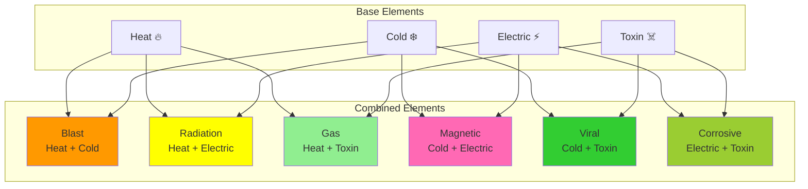
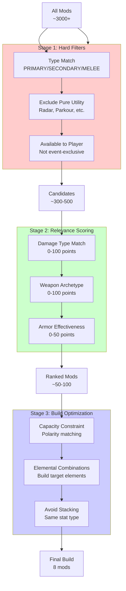
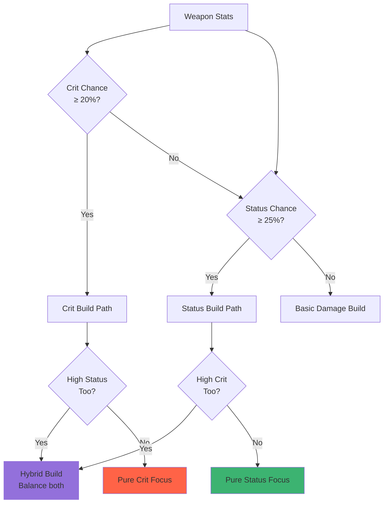
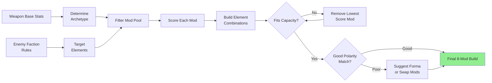

# Mod Analysis & Recommendation System

## Purpose

How do we help players figure out which mods to use for a specific weapon + warframe + enemy faction combination?

This doc explores techniques to filter and rank the ~3000+ mods in Warframe down to a sensible, optimized build recommendation.

## The Problem

Given:
- A weapon (with stats: crit chance, status chance, damage distribution)
- A warframe (with abilities and synergies)
- An enemy faction (Grineer, Corpus, Infested, etc.)

Find:
- The 8 best mods for that weapon
- That maximize damage against that faction
- While respecting build constraints (capacity, polarity, etc.)

## Elemental Damage System

Warframe has a complex elemental combination system. Understanding this is critical for mod recommendations.



**Key Rules:**
- Mod order matters! Elements combine left-to-right
- Can have up to 2 combined elements per weapon
- Physical damage (Impact, Puncture, Slash) doesn't combine

## Enemy Faction Weaknesses

### Grineer Example

**Strengths:**
- Heavy armor (especially at high levels)
- Use attrition and ambush tactics
- Advanced weapons and reactive armor
- Kuva Grineer resistant to Heat

**Weaknesses:**
- Vulnerable to: Impact, Corrosive, Puncture, Radiation, Viral
- Heavy units vulnerable to status effects
- Slash status bypasses armor (DOT ignores armor values)

**Priority Damage Types:**
1. **Corrosive** - strips armor over time
2. **Slash (status)** - bypasses armor entirely
3. **Viral** - reduces max health (synergizes with slash)
4. **Radiation** - confuses enemies, good damage bonus
5. **Puncture** - bonus against armor

## Multi-Tier Filtering Pipeline



## Weapon Archetype Detection

How do we know if a weapon is status-based or crit-based?

### Status Weapons
**Indicators:**
- Base status chance ≥ 25%
- High fire rate or pellet count
- Multiple damage types in base damage

**Mod Priorities:**
1. Status Chance mods (60/60 mods: +60% damage, +60% status)
2. Multishot (more projectiles = more status procs)
3. Elemental damage (each element can proc)
4. Base damage multipliers

### Crit Weapons
**Indicators:**
- Base crit chance ≥ 20%
- Base crit multiplier ≥ 2.0x
- Lower status chance (< 20%)

**Mod Priorities:**
1. Critical Chance (+150-200%)
2. Critical Damage multipliers (+120-165%)
3. Base damage (+165%)
4. Elemental damage (secondary)

### Hybrid Weapons
Some weapons are both! (e.g., 25% crit, 30% status)
- Include both crit and status mods
- Balance based on which stat is higher
- Often requires more specialized builds



## Scoring System

### For Grineer (Status Weapon Example)

```python
def calculate_mod_score(mod, weapon_type, enemy_faction):
    score = 0
    
    # Parse mod effects (regex or NLP)
    effects = parse_mod_effects(mod.Effects)
    
    # Damage type scoring (Grineer-specific)
    if "Corrosive" in effects:
        score += effects["Corrosive"] * 3.0  # High priority
    if "Viral" in effects:
        score += effects["Viral"] * 2.5
    if "Radiation" in effects:
        score += effects["Radiation"] * 2.5
    if "Slash" in effects:
        score += effects["Slash"] * 3.0  # Bypasses armor
    if "Puncture" in effects:
        score += effects["Puncture"] * 2.0
    if "Heat" in effects:
        score += effects["Heat"] * 0.5  # Kuva Grineer resist
    
    # Archetype scoring (Status weapon)
    if "Status Chance" in effects:
        score += effects["StatusChance"] * 2.5
    if "Multishot" in effects:
        score += effects["Multishot"] * 2.0
    if "Fire Rate" in effects:
        score += effects["FireRate"] * 1.5  # More procs/second
        
    # Base damage always useful
    if "Damage" in effects:
        score += effects["Damage"] * 1.5
    
    # Efficiency factor (score per mod capacity)
    efficiency = score / max(mod.BaseDrain, 1)
    
    return score, efficiency
```

### Weight Tables by Faction

| Damage Type | Grineer | Corpus | Infested |
|------------|---------|--------|----------|
| Corrosive  | 3.0     | 1.0    | 2.5      |
| Viral      | 2.5     | 1.5    | 3.0      |
| Radiation  | 2.5     | 1.0    | 1.0      |
| Magnetic   | 1.0     | 3.0    | 0.5      |
| Gas        | 1.0     | 1.0    | 2.5      |
| Toxin      | 1.5     | 2.5    | 1.0      |
| Slash      | 3.0     | 1.5    | 2.0      |
| Impact     | 2.0     | 2.5    | 1.0      |
| Puncture   | 2.0     | 1.0    | 1.0      |

## Effect Parsing Techniques

Mod effects are stored as text strings. We need to extract structured data.

### Regex Patterns

```regex
# Percentage-based stats
\+(\d+(?:\.\d+)?)%\s+(Critical Chance|Status Chance|Multishot|Damage)

# Flat bonuses
\+(\d+(?:\.\d+)?)\s+(Status Chance|Critical Chance)

# Elemental damage
\+(\d+(?:\.\d+)?)%\s+(Heat|Cold|Electric|Toxin|Corrosive|Viral|etc.)

# Physical damage
\+(\d+(?:\.\d+)?)%\s+(Impact|Puncture|Slash)

# Special effects
(Critical Chance|Status Chance).+?on\s+(headshot|kill|etc.)
```

### Example Mod Parsing

```json
{
  "Name": "Serration",
  "Effects": [["+15% Damage"], ["+30% Damage"], ["..."], ["+165% Damage"]]
}
```

Parsed to:
```javascript
{
  stats: {
    "Damage": { min: 15, max: 165, type: "percentage" }
  }
}
```

## Build Optimization Flow



## Elemental Combination Builder

This is tricky: we need to figure out WHICH elemental mods to include and in WHAT ORDER to create target combined elements.

### Target: Corrosive + Heat (vs Grineer)

**Goal:** Electric + Toxin = Corrosive, then add Heat

**Mod Order:**
1. Electric mod (e.g., Stormbringer +90% electric)
2. Toxin mod (e.g., Infected Clip +90% toxin)
3. Heat mod (e.g., Hellfire +90% heat)

**Result:** Corrosive (combined) + Heat (standalone)

### Algorithm

```javascript
function buildElementalCombination(targetElements) {
  const elementalMods = [];
  const combinations = {
    "Corrosive": ["Electric", "Toxin"],
    "Viral": ["Cold", "Toxin"],
    "Radiation": ["Heat", "Electric"],
    // ... etc
  };
  
  for (const target of targetElements) {
    if (combinations[target]) {
      // Need base elements in correct order
      const [elem1, elem2] = combinations[target];
      elementalMods.push(findBestMod(elem1));
      elementalMods.push(findBestMod(elem2));
    } else {
      // Direct element
      elementalMods.push(findBestMod(target));
    }
  }
  
  return elementalMods;
}
```

## Build Constraints

### Mod Capacity
- Each weapon has a capacity (30 base, up to 60 with Orokin Catalyst)
- Mods cost capacity based on `BaseDrain`
- Polarity match: drain ÷ 2 (rounded up)
- Polarity mismatch: drain + 25%

### Polarity Optimization

```
Mod Drain: 11
Weapon Slot: V (Madurai)
Mod Polarity: V (Madurai)
→ Actual Drain: 6

Mod Polarity: - (Naramon)
→ Actual Drain: 14
```

**Strategy:**
- Prioritize mods that match existing polarities
- Suggest Forma locations for mismatched high-value mods

## Negative Filters (Anti-Patterns)

Things to AVOID including:

1. **Heat vs Kuva Grineer** - They're resistant
2. **Pure Utility Mods** - Radar, parkour when asking for combat build
3. **Duplicate Effects** - Game limits stacking (e.g., can't use two "Serration" mods)
4. **Wrong Weapon Type** - PRIMARY mod on SECONDARY weapon
5. **Status on Pure Crit Weapon** - Low base status means diminishing returns
6. **Crit on Pure Status Weapon** - Doesn't benefit enough

## Warframe Synergies

Some warframes amplify certain playstyles:

### Chroma
- Ability boosts elemental damage of equipped element
- **Synergy:** Use same element on weapon as Chroma's energy color
- **Priority:** If Chroma uses Ice, prioritize Cold mods

### Saryn
- Toxin and Viral expert
- **Synergy:** Weapons with high status + Toxin/Viral
- **Priority:** Viral + Toxin damage mods

### Mesa
- Buffs secondary weapons
- **Synergy:** Invest more in secondary weapon mods
- **Priority:** Crit mods if using Regulators

### Detection Strategy

```javascript
function detectWarframeSynergy(warframe, weapon) {
  const synergies = {
    "Chroma": {
      boosts: ["elemental_damage"],
      preferredElements: getChromaElement(warframe.energyColor),
      modPriorityAdjust: { "elemental": +1.5 }
    },
    "Saryn": {
      boosts: ["toxin", "viral"],
      preferredWeaponTypes: ["status"],
      modPriorityAdjust: { "Toxin": +2.0, "Viral": +2.0 }
    },
    // ... etc
  };
  
  return synergies[warframe.name] || null;
}
```

## Implementation Considerations

### 1. Data Requirements

**Must Have:**
- Mod database (we have this: `mods_public_export.json`)
- Enemy faction weaknesses (we have this: rule system)
- Elemental combination rules (static data)

**Should Have:**
- Weapon base stats (crit%, status%, damage distribution)
- Player's owned mods (to filter unavailable mods)
- Weapon capacity after Forma/Catalyst

**Nice to Have:**
- Warframe ability data for synergy detection
- Player's preferred playstyle (aggressive vs. defensive)
- Mission type context (long endless vs. quick runs)

### 2. Output Format Options

**Option A: Ranked List**
- Return top 20 mods ranked by score
- Let player pick 8 manually
- Show reasoning for each ("Good vs. Grineer armor")

**Option B: Complete Build**
- Return optimized 8-mod loadout
- Include mod order (for element combinations)
- Show total capacity used

**Option C: Multiple Build Options**
- Generate 3-5 different build archetypes
- "Max Damage", "Balanced", "Status Focus", etc.
- Let player choose preferred approach

**Option D: Interactive Builder**
- Show all relevant mods
- Let player add/remove, see live scoring
- Suggest improvements dynamically

### 3. Performance Optimization

With 3000+ mods, filtering needs to be fast:

1. **Index by Type** - Prefilter by weapon type (PRIMARY/SECONDARY/MELEE)
2. **Cache Parsed Effects** - Don't regex parse on every query
3. **Limit Scoring** - Only score top 200 mods after hard filters
4. **Lazy Load Details** - Only parse full effects for top candidates

### 4. Testing Strategy

**Unit Tests:**
- Elemental combination logic
- Score calculation for known mod + enemy combos
- Capacity constraint validation

**Integration Tests:**
- Full pipeline: weapon stats → build recommendation
- Compare against known "meta" builds

**Evaluation Harness:**
- Use the `RuleEvaluation` project approach
- Compare LLM recommendations vs. rule-based system
- Measure against community "meta" builds

## Example: Complete Flow

**Input:**
- Weapon: Kuva Bramma (Bow, 34% crit, 17% status)
- Warframe: Rhino (no special synergies)
- Enemy: Grineer

**Step 1: Archetype Detection**
- 34% crit → Crit weapon
- 17% status → Somewhat low, but viable
- **Result:** Crit-focused hybrid

**Step 2: Target Elements**
- Grineer weak to: Corrosive, Viral, Radiation
- **Result:** Build Viral (Cold + Toxin)

**Step 3: Hard Filter**
- Type = PRIMARY
- Exclude utility
- **Result:** ~400 mods

**Step 4: Score**
```
Mod: "Point Strike" (+150% crit chance)
  Crit archetype bonus: 150 * 3.0 = 450 points

Mod: "Vital Sense" (+120% crit damage)
  Crit archetype bonus: 120 * 2.5 = 300 points

Mod: "Infected Clip" (+90% toxin)
  Damage type match: 90 * 2.0 = 180 points
  Element for Viral: +50 bonus = 230 points

Mod: "Cryo Rounds" (+90% cold)
  Damage type match: 90 * 1.5 = 135 points
  Element for Viral: +50 bonus = 185 points
```

**Step 5: Build Optimization**

Final 8 mods (in order):
1. **Serration** (+165% damage) - base multiplier
2. **Point Strike** (+150% crit chance)
3. **Vital Sense** (+120% crit damage)
4. **Split Chamber** (+90% multishot)
5. **Cryo Rounds** (+90% cold) - first element
6. **Infected Clip** (+90% toxin) - combines with cold → Viral
7. **Vigilante Armaments** (+60% multishot) - more procs
8. **Hunter Munitions** (30% slash on crit) - armor bypass

**Capacity:** 58/60 (with forma on key slots)

**Reasoning:**
- Maximizes crit potential (archetype)
- Builds Viral for Grineer (faction weakness)
- Hunter Munitions adds Slash procs on crits (bypasses armor)
- Good multishot for AoE bow explosions

## Future Enhancements

1. **Riven Mod Integration** - Random stat mods that can be game-changing
2. **Arcane Synergies** - Arcanes that buff weapon performance
3. **Companion Mods** - Kavat/Kubrow mods that buff status/crit
4. **Helminth Abilities** - Warframe abilities that synergize with weapons
5. **Galvanized Mods** - Stacking bonus mods for endless missions
6. **Mission Context** - Steel Path vs. normal star chart adjustments
7. **Enemy Level Scaling** - Different builds for level 30 vs. 150+

## References

- Mod data: `tests/Mentor.Core.Tests.RuleEvaluation/Tests/Data/mods_public_export.json`
- Enemy rules: Game rule JSON structure (hierarchical)
- Warframe Wiki: Damage 2.0 system documentation


